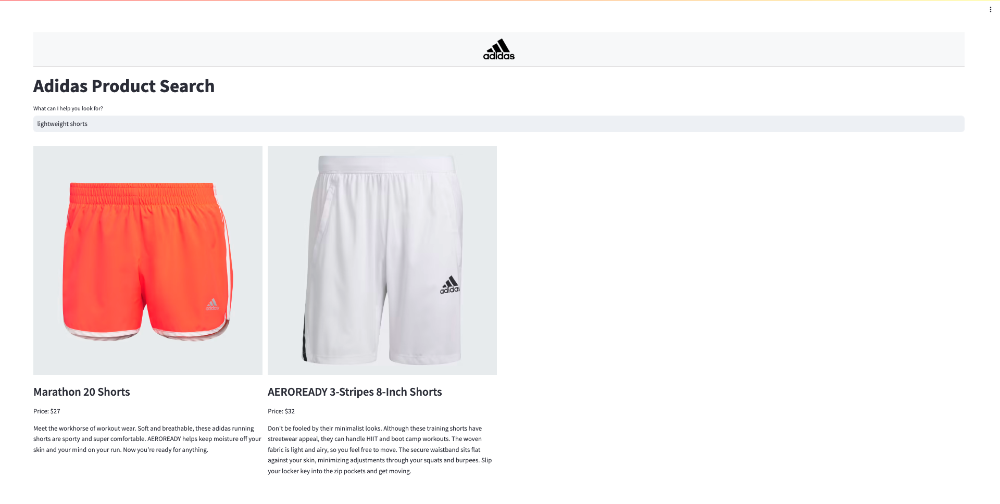
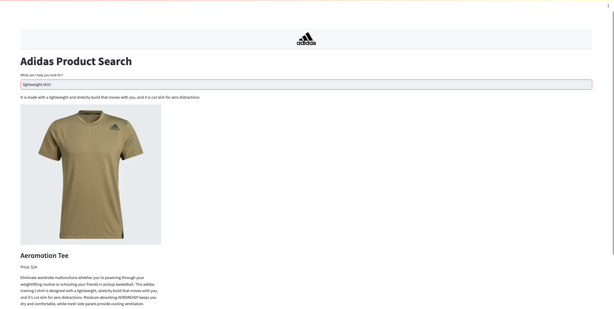

# Adidas-Product-Recommender

Using `Langchain` and `OpenAI` to create a product search platform that enables users to find desired Adidas products through search queries.






## Project Motivation

The motivation for this project was to see how generative AI can be leveraged for different kinds of applications. In this case, how generative AI can be used in the retail space.

## Repository Structure and File Description

```markdown
├── bin                                     # folder for main file
│   ├── app.py                              # code for Streamlit application
│   └── ingest.py                           # code to create vector database
├── data                                    # folder containing data
│   ├── adidas_usa_descriptions.csv         # csv file
│   └── adidas_usa.csv                      # csv file
├── images                                  # folder containing images used in ReadME
│   ├── images.png                          # image 1
│   └── images.png                          # image 2
├── notebooks                               # jupyter notebook
│   ├── adidas-product-recommender.ipynb    # main notebook     
├── src                                     # folder containing functions
│   ├── column_dict.py                      # function to create info dictionaries
│   ├── create_product_info.py              # function to create product info
│   ├── display_product_info.py             # function to display product info on frontend
│   ├── qa_chain.py                         # function to create question answering chain
│   └── styles.css                          # css code
├── vectordb                                # folder containing vector database files
│   ├── index.faiss                         # 
│   └── index.pkl                           # 
├── Dockerfile                              # Dockerfile for application
├── requirements.txt                        # libraries need for application
```

## Requirements
You will need an OPENAI_API_KEY.

## Installations
The packages and libraries required for this project are in the `requirements.txt` file.

## How to Interact With The Project

1. Clone the repository to your local machine using the following command:
```
git clone hhttps://github.com/zhikaichen99/Adidas-Product-Search.git
```
2. Navigate to repository
3. Obtain an `OpenAI` API Key
4. Create a `.env` file and paste the following in the file:
```
OPENAI_API_KEY=YOUR_OPENAI_API_KEY
```
5. Install requirements by running:
```
pip install -r requirements.txt
```
6. Run `ingest.py` if there is no vector database or if you want to create a new vector database using your own data.
```
python ./bin/ingest.py
```
7. Run the Streamlit application:
```
streamlit run ./bin/app.py
```